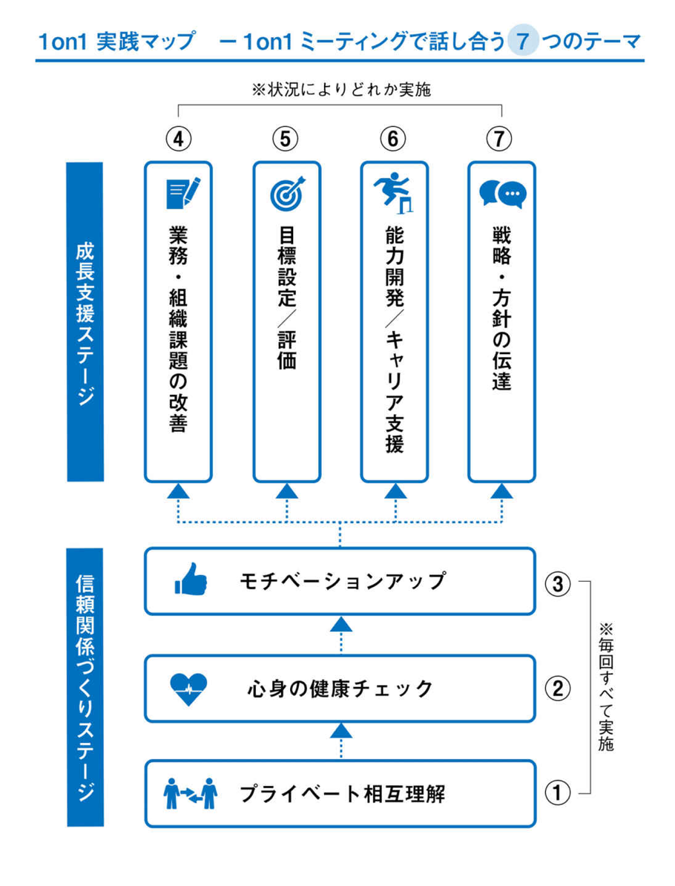

# 1on1

目次  
(VSCodeの拡張機能「Auto Markdown TOC」で自動更新)

<!-- TOC -->

- [1 on1](#1-on1)
    - [目的](#目的)
    - [目標](#目標)
    - [実践マップ](#実践マップ)
    - [質問・伝え方例一覧](#質問・伝え方例一覧)
        - [プライベート相互理解 (毎回必須)](#プライベート相互理解-毎回必須)
        - [心身の健康チェック (毎回必須)](#心身の健康チェック-毎回必須)
        - [モチベーションアップ (毎回必須)](#モチベーションアップ-毎回必須)
        - [業務・組織課題の改善](#業務・組織課題の改善)
        - [目標設定／評価](#目標設定／評価)
        - [能力開発／キャリア支援](#能力開発／キャリア支援)
        - [戦略・方針の伝達](#戦略・方針の伝達)
        - [まとめとアクションプラン](#まとめとアクションプラン)

<!-- /TOC -->

## 目的

- 社員の成長を支援する。

- 業務をスムーズに遂行・継続できるよう環境を整える。
  - マインドトークループの解消。
  - 個人の生き方や個人を取り巻く環境が非常に多様化、複雑化しており、仕事に影響を与える個別の事情が増えている。
  - 会社以外での個人事情の複雑化（親の介護、男性の育児参加〈イクメン〉、女性の働き方、保育園事情、セクシャルマイノリティ）
  - ブラック企業や過労死など、残業や働き方の社会問題化による管理義務の強化に対応する。

- 不慮の事態に備える

  部下が上司を呼び出すときは「よっぽど」の状況下。  
  たとえば、いまの仕事に悩んだ結果、すでに転職先を決めて退職の申し出たなど。  
  早めに情報共有して対処していれば防げる問題かもしれない。

## 目標

- レベル1
  
  コミュニケーション量増加によって、上司と部下の信頼関係がつくられる。

- レベル2

  「傾聴」を通して、部下理解が深まる。上司と部下の相互理解の深まり。

- レベル3

  「承認」を通じて部下のモチベーションが上がる。

- レベル4

  「質問」や「フィードバック」を通じて、部下が業務から「学び」や「気づき」を獲得する。

- レベル5

  「学び」や「気づき」をもとにして、部下が新たな行動やチャレンジをする。

## 実践マップ

## 質問・伝え方例一覧

### プライベート相互理解 (毎回必須)

レベルごとの雑談。
「納得」を求めず相手に「共感」することが大切。

- レベル1

  世の中の出来事や、チーム内の出来事を話す。

  - [ ] 実家ってどこでしたっけ？
  - [ ] 今どの辺りに住んでいるんですか？
  - [ ] 何人兄弟なんですか？
  - [ ] 学生時代に一番どんなことをやってたんですか？
  - [ ] 今、趣味とかはまっていることって何ですか？
  - [ ] 週末はどんなことをしてることが多いのかな？
  - [ ] 食べ物の好き嫌いってありますか？

- レベル2

  相手の経験した出来事を聞く。

  - [ ] 小さい頃はどんなことが好きだったんですか？
  - [ ] 仕事以外で、つらかったことってあります？
  - [ ] 尊敬する人っていますか？
  - [ ] 将来的に何をやりたいとか、どうなっていたいんですか？
  - [ ] モチベーションが上がることをたくさん挙げてみて？
  - [ ] 仕事する上で好きなタイプの人と苦手なタイプの人ってどんな人かな？

- レベル3以上は本文参照。

### 心身の健康チェック (毎回必須)

体調や状態をスマイルマークで記録。

- 健康
  - [ ] 最近眠れてますか？
  - [ ] 体調は大丈夫？

- 仕事量
  - [ ] 仕事のボリュームは問題なさそうかな？やり切れているだろうか？
  - [ ] 今何時くらいに帰っている？家でもやってない？

- 環境
  - [ ] 今、社内で何か気になることとかある？
  - [ ] 周りの人とは特に問題なくやれてる？

### モチベーションアップ (毎回必須)

  「最近いいなって思う人いる」を聞いておくと、間接的な褒め方ができる。

- マイナス面を最小化するために **聴ききる** こと。  
  マインドトークのループを解消する。

  - [ ] いろいろあると思うけれど、特にどれが気にかかってるのだろう？
  - [ ] 具体的にはどういうことかな？
  - [ ] もう少し詳しく教えてもらっていいかな？
  - [ ] 他にはどんなことがあるのだろう？

- プラス面を最大化するために、承認する・ほめること。

  - [ ] Doneになったね。
  - [ ] 先日の○○は素晴らしかったね。ちょっと感動したよ。
  - [ ] ○○についてしっかりできているね。いいね。
  - [ ] ○○について評判いいね。
  - [ ] □□さんが絶賛してたよ。
  - [ ] ○○をしてくれてありがとう。とても助かったよ。

### 業務・組織課題の改善

現状業務の把握。

- [ ] 今の業務のポイントを教えてください。
- [ ] 今の業務で関わっている人はどんな人？
- [ ] うまく進んでいると思うけど、今後もし懸念があるとすればどういうことだろう？
- [ ] もう少し任せてほしいなどの要望はあるだろうか？

現状業務の改善

- [ ] 今の業務で困っていることって何かある？
- [ ] 今の業務で難しいことってなんだろう？
- [ ] 今の業務に何があったら、もっとうまくできたり、精度が上がると思う？
- [ ] 今の業務について、何か私にこうしてほしいなどリクエストある？

視点をチームに広げる

- [ ] 今のチームの良いところって何があると思う？
- [ ] 今のチームの課題って何があるとおもう？
- [ ] もっとチームを良くするために何ができるだろう？
- [ ] 〇〇さんからみて今のチームメンバーって力を発揮できていると思う？
- [ ] 最近調子いいなって思う人いる？
- [ ] 最近大丈夫かなって気になる人とかいる？

事業や組織の未来についての質問

- [ ] 目的のために、今後うちのチームはどんなことに取り組んでいくべきだと思う？
- [ ] この市場環境の変化に対して、〇〇さん地震考えていることや、とりくみたいな、と思っていることって何かある？

### 目標設定／評価

目標設定

- [ ] 次の評価期間で目標にしたいことを教えてください。
- [ ] この目標になった背景を教えてください。
- [ ] この目標は全体のどこにつながっているかわかるでしょうか？
- [ ] この目標を達成することで、〇〇さんは何が得られるでしょうか？
- [ ] この目標をやらないことで、〇〇さんが失うものはなんでしょうか？
- [ ] これを達成していく上で武器になるものは何があるでしょうか？
- [ ] これを達成していく上で、効率化できることは何があるでしょうか？

評価

- [ ] この評価期間において、自分に評価をつけると10点満点で何点ですか？
- [ ] 点数の理由はなんでしょうか？（その心は？）
- [ ] この評価期間で残した結果について教えてください。
- [ ] 結果について、できた／できなかった要因をどのように分析しますか？
- [ ] なぜ達成できた／できなかったのでしょうか？
- [ ] この評価期間で、特に意識して頑張ったことや工夫したことはなんでしょう？
- [ ] この評価期間で、スキルや能力面で伸びたと思うところを教えてください。

### 能力開発／キャリア支援

能力開発

- [ ] 今期に意識づけたい自分の能力開発のテーマってなんだろう？
  
  - それに関してこの1ヶ月で取り組んだこととかある？
  - それに関して難しいことってどんなところ？

- [ ] この1ヶ月で業務で一番力を入れた業務ってなんでしょうか？

  - それについて自分で学べたことや気づいたところってどんなところ？

- [ ] 私や他のメンバーへのリクエストとかある？ サポートしてほしいことなど。
- [ ] 〇〇さんのパフォーマンスだと今の業務は退屈じゃないかな？
- [ ] 今、戦略方針を考えているんだけど、ちょっと相談にのってもらえるかな？

強み・弱みの確認

- [ ] 自分の今の強みはなんだと思う？
- [ ] 自分の今の弱みはなんだと思う？
- [ ] 今の業務に強みを活かすとどういうことができるかな？
- [ ] 今の業務でのやりがいってなに？
- [ ] 業務をする上で胎児にしていることを3つ挙げるとしたら？

将来のキャリアについて

- [ ] キャリアの方向性とかやりたいことは変わっていない？
- [ ] 今後、部署やチームに対してどういう貢献をしていきたい？
- [ ] 将来的に関わりたい仕事やキャリアの方向性があれば教えてください。
- [ ] どんな人としてありたい？
- [ ] 突き詰めると、これからどういう能力を伸ばしていきたいですか？

### 戦略・方針の伝達

逆報連相

- [ ] 会議で決まったことを伝える。
  - その背景・理由「なぜこうなったか」
  - ということで、〇〇さんにはこういうことを行なってほしいんです。

### まとめとアクションプラン

- [ ] 今日話してみて一番印象に残ったことは？
- [ ] 今日話したことで一番覚えておきたいことは？
- [ ] 今日の話を自分の言葉でまとめると？
- [ ] つぎに向けて何をチャレンジする？
- [ ] 5W1Hの確認
  - いつから？
  - どこで？
  - だれが？
  - なにを？
  - どうやって？
- [ ] それを達成するために私にできることはある？

